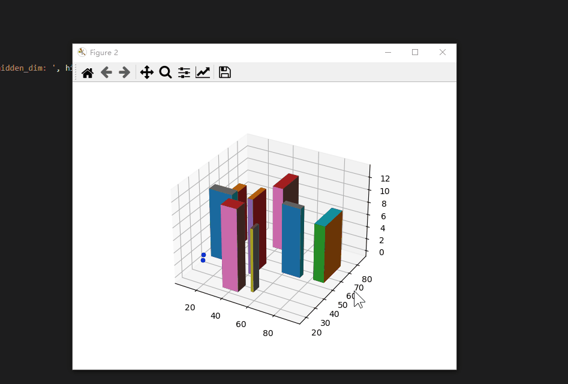
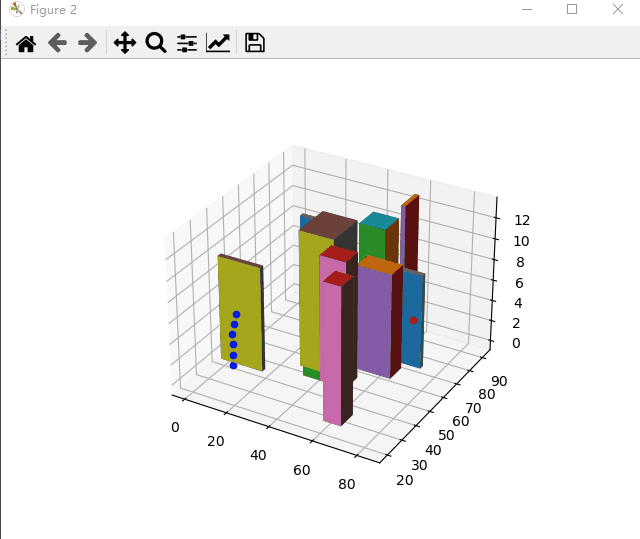

# DQN-based-UAV-3D_path_planer
Realization of UAV's Track Planning in 3D Urban Environment Based on Reinforcement Learning Algorithm(DQN)

本文基于强化学习算法DQN实现离散3维城市空间环境下的智能航线规划，能根据无人机感知进行避障，并根据风速情况选择能耗较低的路线。

## 环境需求
python 3.7

pytorch(cuda)
## 模型简介
采用课程学习方式对无人机智能体进行训练，利用设置好的不同难度的课程对智能体进行梯度训练，能让智能体更快地获取决策经验。由于训练初期缺乏决策经验，需要随机选择行为对环境进行试探，本文设置随机试探周期为1000，周期内采用ε-贪心策略选择智能体行为，周期内贪心概率从1逐渐递减到0.01。1000周期后贪心概率保持在0.01。在一个周期的训练场景中随机生成15个无人机对象，当所有无人机进入终止状态（电量耗尽、坠毁、到达目标点、超过最大步长）后进入下一个周期的训练，当80%以上的无人机能够到达目标点时进入下一难度等级的训练。
经过13万周期、19小时的迭代训练，最终无人机智能体能够在难度5的环境中以97%的任务完成率安全到达目标点，训练模型的累积得分情况如5.1所示。由图5.1可知，模型在随着训练轮次的增加每1000轮次的平均得分逐渐增加，模型在100k回合后分数开始收敛，模型趋于稳定。

## 项目说明
DQN.py:(main函数 入口1)设置模型训练参数与城市环境参数，对DQN模型进行训练，输出Qlocal.pth与Qtarget.pth文件

watch_uav.py：(main函数 入口2)对训练好的决策模型进行测试，载入Qlocal.pth与Qtarget.pth文件，对无人机航迹规划过程进行可视化
 

env.py：设置env类，对城市环境进行描述，实现该环境中的所有UAV与传感器运行的仿真模拟

model.py：神经网络模型的定义

replay_buffer.py：经验池的定义

UAV.py：定义UAV类，对无人机的自身参数与行为进行描述

## 训练参数设置
## 无人机状态空间
## 无人机动作空间
## 奖励函数设置
